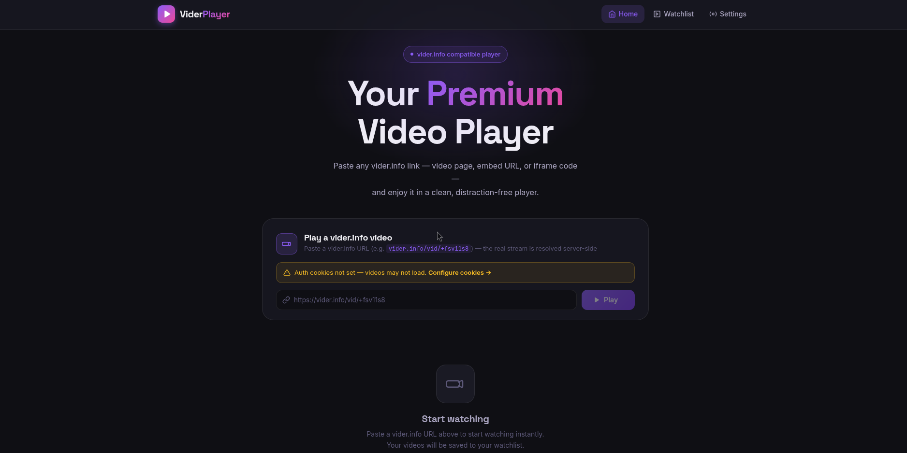
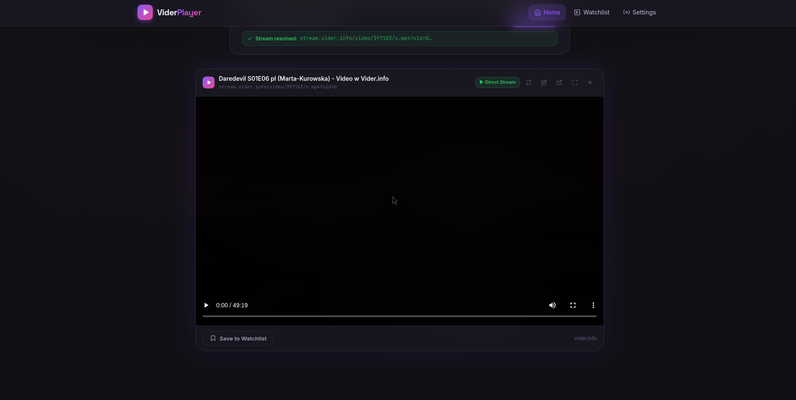
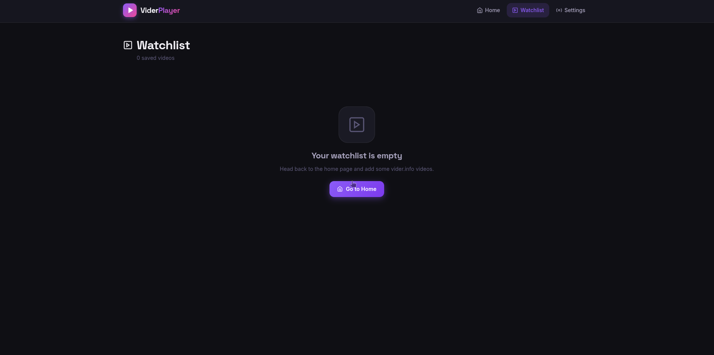
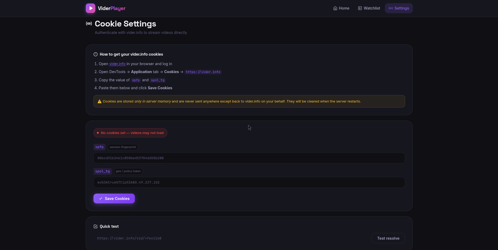
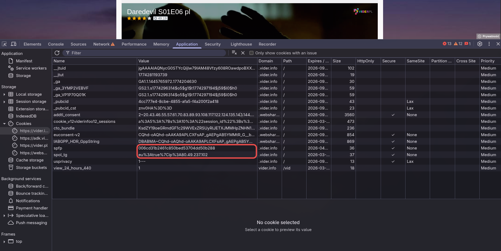

# 🎬 Vider Player

> A sleek, self-hosted Nuxt 4 web player for [vider.info](https://vider.info) videos. Paste a vider.info link and watch your movie — no ads, no popups, no hassle.

| Home | Player |
|---|---|
|  |  |

| Watchlist | Settings |
|---|---|
|  |  |


---

## ✨ Features

- 🔗 **Paste & Play** — drop any `vider.info` link into the input; the app resolves the stream URL automatically
- 📺 **Native video player** — full controls, seeking, and fullscreen support via HTML5 `<video>` with Range request proxying
- 📋 **Watchlist** — save and manage videos for later
- ⚙️ **Settings** — configure your vider.info auth cookies so private videos work
- 🌙 **Dark, glassmorphism UI** — built with Inter & Space Grotesk, smooth animations
- 🔒 **Privacy-first proxy** — all stream requests are routed through the server with your cookies; the browser never talks to vider.info directly

---

## 🏗️ Tech Stack

| Layer | Technology |
|---|---|
| Framework | [Nuxt 4](https://nuxt.com) (Vue 3) |
| Language | TypeScript |
| Styling | Vanilla CSS (custom design system) |
| Fonts | Inter, Space Grotesk (Google Fonts) |
| Server | Nitro (built into Nuxt) |

---

## 🚀 Getting Started

### Prerequisites

- **Node.js** ≥ 18
- **npm** (or pnpm / yarn / bun)

### 1. Clone the repository

```bash
git clone https://github.com/Anonym2137/vider.info-player.git
cd vider.info-player
```

### 2. Install dependencies

```bash
npm install
```

### 3. Start the development server

```bash
npm run dev
```

Open [http://localhost:3000](http://localhost:3000) in your browser.

---

## 🍪 Cookie Setup (Required for private/member videos)

Vider Player proxies requests to vider.info using your session cookies so that member-only videos play correctly.

### How to get your cookies

1. Go to [vider.info](https://vider.info) in your browser
2. Open **DevTools** → **Application** → **Cookies** → `https://vider.info`
3. Copy the values of:
   - `spfp`
   - `spol_tg`



### How to set your cookies in the app

1. Open **Settings** (gear icon in the navbar)
2. Paste the `spfp` and `spol_tg` values into the respective fields
3. Click **Save** — the server stores them in memory for the session

> **Note:** Cookies are stored in server memory only and are never written to disk or sent to any third party. They reset when the server restarts.

---

## 🎞️ How to Play a Video

1. Go to the **Home** page
2. Paste a `vider.info` video URL into the input field  
   (e.g. `https://vider.info/video/12345/movie-title`)
3. Click **Play** (or press Enter)
4. The app resolves the direct stream URL and loads the player

---

## 📦 Building for Production

```bash
npm run build
```

Preview the production build locally:

```bash
npm run preview
```

See the [Nuxt deployment docs](https://nuxt.com/docs/getting-started/deployment) for hosting on Node.js, Docker, static hosts, etc.

---

## 🗂️ Project Structure

```
vider-player/
├── app/
│   ├── components/
│   │   ├── AppNavbar.vue      # Top navigation bar
│   │   ├── UrlInput.vue       # URL paste & resolve input
│   │   ├── VideoCard.vue      # Watchlist video card
│   │   └── VideoPlayer.vue    # HTML5 video player with proxy
│   ├── pages/
│   │   ├── index.vue          # Home / player page
│   │   ├── watchlist.vue      # Saved videos
│   │   └── settings.vue       # Cookie configuration
│   └── assets/css/main.css    # Global styles & design tokens
├── server/
│   ├── api/
│   │   ├── resolve.post.ts    # Extracts stream URL from a vider.info page
│   │   ├── stream.get.ts      # Proxies video bytes (handles Range requests)
│   │   ├── cookies.get.ts     # Returns whether cookies are configured
│   │   └── cookies.post.ts    # Saves spfp / spol_tg cookies to memory
│   └── utils/
│       └── cookieStore.ts     # In-memory cookie store
├── nuxt.config.ts
└── package.json
```

---

## ⚙️ Server API Reference

| Endpoint | Method | Description |
|---|---|---|
| `/api/resolve` | `POST` | Accepts `{ url }`, returns `{ streamUrl, embedUrl, title }` |
| `/api/stream` | `GET` | Proxies video bytes; pass `?url=<encoded-stream-url>` |
| `/api/cookies` | `GET` | Returns `{ configured: boolean }` |
| `/api/cookies` | `POST` | Accepts `{ spfp, spol_tg }`, stores cookies in memory |